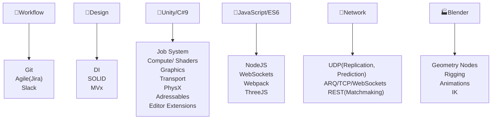

👋 Some skills acquired from my six-year adventure in game development.

 

```mermaid
flowchart TD
markdown["👯Workflow"]
    newLines["Git 
    Agile(Jira) 
    Slack"]
    markdown --> newLines

markdown1["👷Design"]
    newLines1["DI 
    SOLID 
    MVx"]
    markdown1 --> newLines1

markdown2["🍰Unity/C#9"]
    newLines2["Job System 
    Compute/ Shaders 
    Graphics 
    Transport 
    PhysX 
    Adressables 
    Editor Extensions"]
    markdown2 --> newLines2

markdown5["🍵JavaScript/ES6"]
    newLines5["NodeJS 
    WebSockets 
    Webpack 
    ThreeJS"]
    markdown5 --> newLines5

markdown3["📡Network"]
    newLines3["UDP(Replication, Prediction) 
    ARQ/TCP/WebSockets 
    REST(Matchmaking)"]
    markdown3 --> newLines3

markdown4["🏭Blender"]
    newLines4["Geometry Nodes 
    Rigging 
    Animations 
    IK"]
    markdown4 --> newLines4
```
